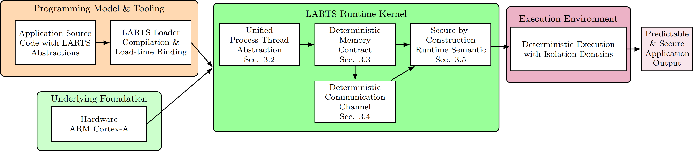

# LARTS: Language Abstractions for Real-Time and Secure Systems
This repository contains evaluation scripts and resources for the real-time system framework presented in our research. The framework integrates four core subsystems to deliver robust, secure, and predictable real-time performance.

## 🛠️ Framework 

The framework is built on a layered architecture:



**Programming Model & Tooling Layer**

- Application development using LARTS abstractions
- LARTS loader for compilation and load-time binding
- Unified Process-Thread model 
- Deterministic Memory Domains
- Deterministic Channels
- Secure Runtime Semantics

**Execution Environment Layer**

- Deterministic execution with isolation domains
- Predictable and secure application output
- Real-time guarantees enforcement

**Underlying Foundation**

- Hardware support for ARM Cortex-A platforms
- Low-level system primitives and isolation mechanisms

## 📋 Quick Start

The project's source code is currently not open-sourced. We have made available certain binary programs compiled using the LARTS kernel.

* How to use Docker to build a runtime environment for pre-compiled binaries ? (Verified)

```shell
# Recommended: Ubuntu 20.04
# create docker container
# optional(Port Forwarding/File mapping)
# b7bab04fd9aa (replace your ubuntu20.04 image)
docker run -it --name LARTS b7bab04fd9aa /bin/bash
# Install dependencies and required components
apt update && apt install sudo -y
sudo apt upgrade
sudo apt-get install -y autoconf automake libtool pkg-config
sudo apt-get install -y cmake
sudo apt install -y build-essential bison flex unzip
sudo apt install -y texinfo
sudo apt install -y python3.8 python3.8-dev
sudo apt install -y python-is-python3 
sudo apt install -y libgmp-dev libmpfr-dev libmpc-dev
# C++ Dependencies
sudo apt-get install -y qemu qemu-user qemu-user-static qemu-system qemu-system-misc binfmt-support
# If not installed, libraries may not be found on armv8.
sudo apt-get install -y g++-aarch64-linux-gnu
cp /usr/aarch64-linux-gnu/lib/* /lib/
# If using WSL2 in windows10/11, omitting this step will cause paths similar to Windows to be loaded by default, resulting in errors.
export PATH=/usr/local/sbin:/usr/local/bin:/usr/sbin:/usr/bin:/sbin:/bin
# Clone Repository
mkdir -p /LARTS && cd /LARTS
git clone https://github.com/Kingsdom005/LARTS.git
cd ./LARTS

# For armv7 testing, please refer to ./Armv7/README.md

# For armv8 testing, please refer to ./Armv8/README.md


# ARMv7 Test
qemu-system-arm -serial null -serial mon:stdio -M xilinx-zynq-a9 -m 1024M -gdb tcp::7777 -nographic -no-reboot -append "--video=off --console=/dev/com1" -kernel ./Armv7/LARTS_kernel_armv7_test0.exe
# ARmv8 Test
qemu-system-aarch64 -gdb tcp::7777 -no-reboot -nographic -serial mon:stdio -machine xlnx-versal-virt -m 4096 -kernel ./Armv8/LARTS_kernel_armv8_test0.exe
```

## 📊 Baselines for Reproduction

To reproduce comparative results, the following open-source baseline implementations are available:

- **FreeRTOS**: https://github.com/FreeRTOS/FreeRTOS-Kernel
- **Zephyr**: https://github.com/zephyrproject-rtos/zephyr
- **RT-Thread**: https://github.com/RT-Thread/rt-thread
- **RTEMS**: https://github.com/RTEMS/rtems/tree/5.1
- **Linux-RT**: https://github.com/clrkwllms/rt-linux

Commercial and private resources and repositories will not be made public.

## 🔧 Compilation Toolchain

The open-source toolchain and libraries currently in use are shared below:

* **RSB**: https://gitlab.rtems.org/rtems/tools/rtems-source-builder.git   (Branch: 5)
* **Musl-Cross-Make**: https://github.com/richfelker/musl-cross-make.git  (Branch: master)
* **Loongarch64 Related**: https://github.com/loongson
  * **binutils & gdb**: https://github.com/loongson/binutils-gdb (Branch: default)
  * **gcc**: https://github.com/loongson/gcc (Branch: default)
  * **newlib**: https://github.com/loongson/newlib (Branch: default)

Certain private toolchain resources and repositories (e.g., musl ulib) will not be made publicly available at this time. Additional toolchain resources will be made available in due course.

## 📈 Available Resources

We will gradually make thesis-related resources available.

## 🔄 Future Releases

We currently provide partial support for the Loongarch64 architecture. Resources related to the Loongson architecture are scheduled for release in February 2026, with plans to support additional architectures and expand functionality in subsequent phases.

All current development and testing is conducted using QEMU. Moving forward, our team will conduct testing on physical hardware and publish relevant test data to advance global operating system research and development.

